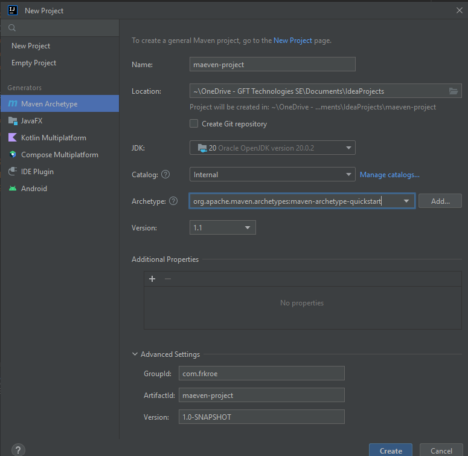

# Maeven Demo

## Description
This repository contains a simple Maven project that can be used to demonstrate the use of Maven in a basic Java project.

## Prerequisites
Download and install the following:
* [IntelliJ IDEA Community Edition](https://www.jetbrains.com/idea/download/)
* [OpenJDK 20.0.2 GA Release](https://jdk.java.net/20/)
* [Apache Maven 3.9.4](https://maven.apache.org/download.cgi) 

Set the following environment variables:
* JAVA_HOME: C:\Program Files\OpenJDK\jdk-20.0.2
* MAVEN_HOME: C:\Program Files\apache-maven-3.9.4
* PATH: %JAVA_HOME%\bin;%MAVEN_HOME%\bin

## Create a Maven Project
Open IntelliJ IDEA and select **Create New Project** and fill in the required fields.

1. Catalog: refers to the set of templates that IntelliJ IDEA uses to generate project structures
2. Archetype: refers to the template that IntelliJ IDEA uses to generate the project structure (here: maven-archetype-quickstart that generates a simple project structure)
3. GroupId: refers to the group or organization that owns the project (e.g. com.example)
4. ArtifactId: refers to the name of the project (here: maeven-project)
5. Version: refers to the version of the project (here: 1.0-SNAPSHOT)
   


## Maven Dependencies
A dependency is a Java library that is required by your project.
Maven uses a pom.xml file to manage dependencies.
The pom.xml file is an XML file that contains information about the project and configuration details used by Maven to build the project.
Once the project is created, IntelliJ IDEA will automatically download the Maven dependencies that are specified in the pom.xml file.
When you want to add new dependencies, you can do so by adding them to the pom.xml file.

### Maven Dependency Scopes
There are different scopes for dependencies:
* compile : the dependency is required for compiling the project (default)
* provided: the dependency is required for compiling the project, but it is provided by JDK or a web server runtime
* runtime: the dependency is required for executing the project
* test: the dependency is only required for testing the project
* System: the dependency is required for compiling and executing the project, but it is not available in a public repository (e.g. a JAR file that is available on your local machine, indicated by the systemPath tag)


### Install Maven Dependencies
1. Look for the required dependency in the [Maven Repository](https://mvnrepository.com/) and copy the Maven dependency code
2. Paste the code within the < dependencies > tag in the pom.xml file
```xml
// e.g. for the gson dependecy (to parse JSON data) and slf4j-api (for logging)
<dependencies>
    
    <dependency>
        <groupId>com.google.code.gson</groupId>
        <artifactId>gson</artifactId>
        <version>2.10.1</version>
        <scope>compile</scope>
    </dependency>
    
   <dependency>
      <groupId>org.slf4j</groupId>
      <artifactId>slf4j-api</artifactId>
      <version>2.0.7</version>
      <scope>compile</scope>
   </dependency>
    
    <dependency>
        <groupId>org.example</groupId>
        <artifactId>maeven-project</artifactId>
        <version>1.0-SNAPSHOT</version>
        <scope>system</scope>
        <systemPath>path/systemPath.jar</systemPath>
    </dependency>

</dependencies>
```
3. Update the Maven project by right-clicking on the pom.xml file and selecting **Maven > Reload Project**

All dependencies being used in the project can be found in the **External Libraries** folder in the project structure.

e is the most important one and is used for deployment of the project